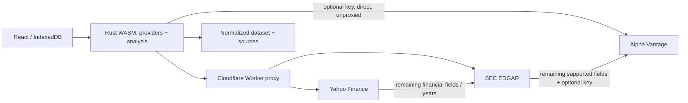

# Provider architecture

`financial-core` owns the portable versioned `Dataset`, analysis and statement
IDs. `financial-providers` owns the async `Provider` trait, `ProviderChain`,
source adapters and WASM exports. The browser build (`crates/financial-providers`
compiled to `wasm32-unknown-unknown`) runs the full provider chain itself; see
[Browser transport](#browser-transport) for why Yahoo and SEC calls route
through the Cloudflare Worker in `worker/`. Another provider can implement the
`Provider` trait without changing the analysis engine or UI. `ProviderChain::new`
fixes the requested priority order.

## Selection and merging

1. Yahoo loads annual statements and company metadata. `yfinance-rs` provides
   typed statements and full daily history. Its typed statement model exposes
   fewer rows than the dashboard, so a supplemental request to Yahoo's
   fundamentals-timeseries endpoint tries every dashboard metric before fallback.
2. Remaining coverage is computed by metric and fiscal year. SEC company facts
   fill gaps, including older annual periods. An unavailable source does not
   prevent trying the next one; usable partial data is retained.
3. Alpha Vantage exists in the chain only when the user supplies a key. The
   adapter selects only statement endpoints capable of filling remaining fields.
   For example, a missing PP&E value requests BALANCE_SHEET, not all statements.
   Missing EPS alone spends no Alpha request because this adapter has no EPS
   source. Company overview is requested only when the name is still missing.
4. Lower-priority values never overwrite existing values, including zero.
   Values require a known, matching reporting currency and exact fiscal dates.
   No currency conversion or alignment of different period ends is inferred.
   Derived free cash flow, gross profit and working capital carry source labels.
5. Prices use Yahoo's full available daily history, then optional Alpha Vantage
   full daily history. EDGAR has no market-price capability and makes no SEC
   request for prices. Alpha full history may require a suitable paid plan.

The UI always requests coverage for ten fiscal years ending at the latest
revenue year (or the entered end year on a refresh), regardless of the
selected display window, so subsequent 3/5/10-year selections can run
locally. This matters because Yahoo's free statement data reliably covers
only about 3 recent fiscal years; requesting the full ten lets SEC EDGAR (and
an optional Alpha Vantage key) fill in older years where they can, even
though the dashboard displays 3 years by default. Providers can supply more
history; the provider chain preserves it. Missing or unsupported fields
remain gaps. Historical windows outside a saved snapshot require setting the
end year and using Refresh data.

## Crate choice

- [yfinance-rs 0.9.1](https://docs.rs/yfinance-rs/0.9.1/yfinance_rs/): typed async
  statements, profile and historical prices; configurable transport, timeouts
  and Yahoo authentication. Supplemental timeseries code stays inside its adapter.
- [edgar-rs 0.1.0](https://docs.rs/edgar-rs/0.1.0/edgar_rs/): selected for the
  focused company-facts/submissions API, typed XBRL disclosures, built-in rate
  limiter and configurable HTTP client. [edgarkit](https://docs.rs/edgarkit/0.4.0/edgarkit/)
  also supports these endpoints, with a broader filings/feed/index abstraction
  that this application does not need. This is a fit-for-purpose choice, not a
  claim that one crate is universally best.
- Existing `alpha_vantage 0.11.0`: retains its bounded transient/quota retries
  and redacted user-facing errors.

Two edgar-rs details are handled explicitly: its custom HTTP client needs its
own User-Agent header, and `get_tickers()` rekeys by CIK, losing multiple share
classes. The adapter therefore loads the SEC ticker file into a ticker-keyed
map using the same configured HTTP client, and uses edgar-rs for company facts.
Ticker mappings are cached for one day, and the most recent company facts for
one hour. Within each tab (or native process), the shared SEC client limits facts requests
to five per second; its mutex serializes SEC cache misses. The ticker download is an additional request.

## Financial normalization

SEC mappings use consolidated US GAAP concepts and ordered aliases. Duration
facts must come from annual forms (10-K, 20-F, 40-F, including amendments), have
FY context and span 330–380 days. Quarter/YTD values and transition periods
outside this range are excluded. Instant balance facts must match an accepted
annual revenue end. Comparative facts use their actual end date, not the filing's
`fy`, and the latest filed version of each concept/date wins. Currency units and
currency-per-share units are handled separately. Ambiguous currencies are not
combined. IFRS-only issuers and custom XBRL extensions currently fall through to
other sources rather than being guessed. Unsupported revenue segments remain
unavailable.

All figures are base reporting units; the analysis engine converts display
amounts to millions. Source provenance is stored in `sources[metric][date]` and
summarized in report warnings. Legacy Alpha-only cached payloads still parse.

## Browser transport

`web/src/lib/service.ts` constructs one `BrowserProviders` WASM instance per
page (see `crates/financial-providers/src/browser.rs`) and calls its
`financials`/`prices` methods directly; there is no `/api/*` fetch layer.
Alpha Vantage keys are held in memory only for each call and sent straight
from the browser to `alphavantage.co`, never to the Worker. Providers have a
75-second budget each, including price fallback (`ProviderChain`, unchanged
by the transport).

CORS is a response policy controlled by the server receiving the cross-origin
request. An `AllowAnyOrigin` policy on the dashboard or Vite changes only
responses from that server; it cannot change Yahoo's or SEC's response
headers, so calling them directly from the browser fails regardless of any
policy set here. The Cloudflare Worker in `worker/` performs those requests
server-side and sets its own CORS policy on its responses. On the
`wasm32-unknown-unknown` build, `Yahoo::new` and `Edgar::new` take the
Worker's origin and point every Yahoo/SEC base URL at it (see
[patch notes](../vendor/README.md) for the matching `yfinance-rs` change);
native builds and tests are unaffected and still call Yahoo/SEC directly.

## Cloudflare Worker proxy

`worker/` proxies `GET /yahoo/chart/:symbol`, `/yahoo/quoteSummary/:symbol`
and `/yahoo/timeseries/:symbol` to the matching Yahoo Finance endpoint, and
`GET /sec/files/company_tickers.json` / `/sec/api/xbrl/...` to `www.sec.gov`
and `data.sec.gov`. It owns the real Yahoo session (cookie and crumb, fetched
and cached Worker-side) and the real SEC `User-Agent` (from the `SEC_USER_AGENT`
secret). The vendored client never fetches a real cookie or crumb of its own on
wasm32 — the Worker discards and overwrites whatever crumb it receives anyway
— so there is no auth-handshake round trip to reach Yahoo from the browser, and
no credential ever crosses the browser/Worker boundary; every response keeps a
plain `Access-Control-Allow-Origin: *` rather than a credentialed, echoed-origin
response. See [worker/README](../worker/README.md)
for routes, local development and deployment, including the one-time
`PROVIDER_PROXY_URL` repository variable CI needs to build the dashboard
against a real deployment.

## Verification

`cargo test --workspace --locked` covers priority, partial results, annual
history gaps, skipped paid calls, selective Alpha endpoint calls, unsupported
prices, currency/fiscal-date rejection, annual/restated SEC facts, Yahoo annual
rows and normalized analysis. Browser tests use the real WASM provider chain
and analysis engine with intercepted Cloudflare Worker proxy responses, and
reject any request that reaches Yahoo or SEC directly (see `web/tests/upstream.ts`).
They do not consume any upstream API allowance. `worker/` has its own `npm test`
(Vitest) covering routing, session caching and CORS, independent of the
browser tests.

`cargo run -p financial-providers --example yahoo_smoke` is an opt-in live Yahoo
statement/price check. Live SEC checks require a real `SEC_USER_AGENT`; live
Alpha checks require a user-supplied key. Rate limits and upstream coverage may
vary independently of deterministic tests.
