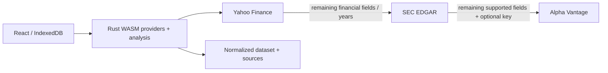

# Provider architecture

`financial-core` owns the portable versioned `Dataset`, analysis and statement
IDs. `financial-providers` owns the async `Provider` trait, `ProviderChain`,
source adapters and WASM exports. Axum and native runtime features are excluded
from the browser build. An optional `server` feature retains the native HTTP API. Another provider can implement the trait without changing the analysis
engine or UI. `ProviderChain::new` fixes the requested priority order.

## Selection and merging

1. Yahoo loads annual statements and company metadata. `yfinance-rs` provides
   typed statements and full daily history. Its typed statement model exposes
   fewer rows than the dashboard, so a supplemental request to Yahoo's
   fundamentals-timeseries endpoint tries every dashboard metric before fallback.
2. Remaining coverage is computed by metric and fiscal year. SEC company facts
   fill gaps, including older annual periods. An unavailable source does not
   prevent trying the next one; usable partial data is retained.
3. Alpha Vantage exists in the chain only when the user supplies a key. The
   adapter selects only statement endpoints capable of filling remaining fields.
   For example, a missing PP&E value requests BALANCE_SHEET, not all statements.
   Missing EPS alone spends no Alpha request because this adapter has no EPS
   source. Company overview is requested only when the name is still missing.
4. Lower-priority values never overwrite existing values, including zero.
   Values require a known, matching reporting currency and exact fiscal dates.
   No currency conversion or alignment of different period ends is inferred.
   Derived free cash flow, gross profit and working capital carry source labels.
5. Prices use Yahoo's full available daily history, then optional Alpha Vantage
   full daily history. EDGAR has no market-price capability and makes no SEC
   request for prices. Alpha full history may require a suitable paid plan.

The UI requests coverage for ten fiscal years ending at the latest revenue year
(or the entered end year on a refresh), so subsequent 5/10-year selections can
run locally. Providers can supply more history; the provider chain preserves it.
Missing or unsupported fields remain gaps. Historical windows outside a saved
snapshot require setting the end year and using Refresh data.

## Crate choice

- [yfinance-rs 0.9.1](https://docs.rs/yfinance-rs/0.9.1/yfinance_rs/): typed async
  statements, profile and historical prices; configurable transport, timeouts
  and Yahoo authentication. Supplemental timeseries code stays inside its adapter.
- [edgar-rs 0.1.0](https://docs.rs/edgar-rs/0.1.0/edgar_rs/): selected for the
  focused company-facts/submissions API, typed XBRL disclosures, built-in rate
  limiter and configurable HTTP client. [edgarkit](https://docs.rs/edgarkit/0.4.0/edgarkit/)
  also supports these endpoints, with a broader filings/feed/index abstraction
  that this application does not need. This is a fit-for-purpose choice, not a
  claim that one crate is universally best.
- Existing `alpha_vantage 0.11.0`: retains its bounded transient/quota retries
  and redacted user-facing errors.

Two edgar-rs details are handled explicitly: its custom HTTP client needs its
own User-Agent header, and `get_tickers()` rekeys by CIK, losing multiple share
classes. The adapter therefore loads the SEC ticker file into a ticker-keyed
map using the same configured HTTP client, and uses edgar-rs for company facts.
Ticker mappings are cached for one day, and the most recent company facts for
one hour. Within each tab (or native process), the shared SEC client limits facts requests
to five per second; its mutex serializes SEC cache misses. The ticker download is an additional request.

## Financial normalization

SEC mappings use consolidated US GAAP concepts and ordered aliases. Duration
facts must come from annual forms (10-K, 20-F, 40-F, including amendments), have
FY context and span 330–380 days. Quarter/YTD values and transition periods
outside this range are excluded. Instant balance facts must match an accepted
annual revenue end. Comparative facts use their actual end date, not the filing's
`fy`, and the latest filed version of each concept/date wins. Currency units and
currency-per-share units are handled separately. Ambiguous currencies are not
combined. IFRS-only issuers and custom XBRL extensions currently fall through to
other sources rather than being guessed. Unsupported revenue segments remain
unavailable.

All figures are base reporting units; the analysis engine converts display
amounts to millions. Source provenance is stored in `sources[metric][date]` and
summarized in report warnings. Legacy Alpha-only cached payloads still parse.

## Browser transport

`BrowserProviders.financials(ticker, apiKey, years, endYear)` and
`BrowserProviders.prices(ticker, apiKey)` return promises of normalized JSON.
One instance per tab retains Yahoo authentication and SEC caches. Alpha keys
are validated and retained only during each call. Providers have a 75-second
budget each, including price fallback.

The build compiles `financial-providers` as a `cdylib`, including the existing
analysis exports from `financial-core`. Both upstream crates use reqwest's WASM
Fetch implementation. Yahoo requests include credentials; the browser stores
cookies, while Rust acquires and refreshes crumbs. No JavaScript reads
`Set-Cookie` or writes `Cookie`/`User-Agent` headers. Timers and cache timestamps
use browser-compatible implementations. See [patch notes](../vendor/README.md).
CORS is left to the browser; there is no proxy or opaque `no-cors` response path.

## Optional native HTTP API

`POST /api/financials` accepts `{ticker, apiKey?, years?, endYear?}` and returns
`Dataset` schema version 1. `POST /api/prices` accepts the same shape and returns
`{ticker, fetchedAt, points, source, outputSize: "full"}`. Years must be 5–10.
`GET /api/health` checks service availability without contacting providers.

Keys are optional, validated, kept only for the request, and never included in
URLs between browser and service. The Alpha crate sends its key to the upstream
API using that API's query convention; upstream errors are redacted. Only deploy
behind a trusted HTTPS endpoint. Responses use `Cache-Control: no-store`, bodies
are limited to 4 KiB, and four concurrent requests are admitted. Financial
providers have a 75-second budget each and requests a 240-second outer budget.
`WEB_ORIGIN` optionally permits one explicit cross-origin UI. Add authentication
and per-user rate limits at your reverse proxy before offering a public service.

## Verification

`cargo test --workspace --locked` covers priority, partial results, annual
history gaps, skipped paid calls, selective Alpha endpoint calls, unsupported
prices, currency/fiscal-date rejection, annual/restated SEC facts, Yahoo annual
rows and normalized analysis. Browser tests use the real WASM clients and engine with intercepted
upstream responses. They reject calls to the native service. They do not consume any upstream API allowance.

`cargo run -p financial-providers --example yahoo_smoke` is an opt-in live Yahoo
statement/price check. Live SEC checks require a real `SEC_USER_AGENT`; live
Alpha checks require a user-supplied key. Rate limits and upstream coverage may
vary independently of deterministic tests.
